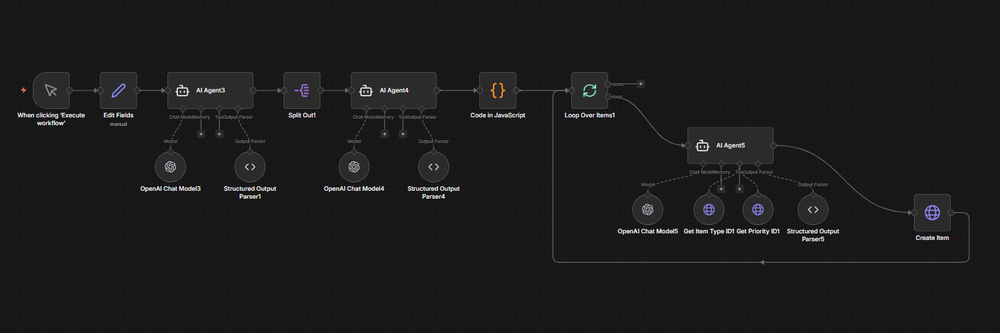

# Zoho Sprints Meeting-to-Tasks Automation (n8n)

An AI-powered n8n workflow that converts meeting transcripts into structured tasks and automatically creates them in Zoho Sprints with intelligent priority assignment.

---

## 📌 Overview

This automation analyzes meeting transcripts, detects actionable items, assigns priorities, and creates tasks directly inside Zoho Sprints.

Instead of manually reviewing meetings and drafting tasks, the workflow:

- Extracts action items from discussions  
- Converts them into structured tasks  
- Assigns priority levels using AI  
- Creates tasks in the selected Zoho Sprints project  

---

## 🔄 Workflow Visual

---

## 🧠 How It Works

### 1️⃣ Transcript Input  
A meeting transcript is provided (manual trigger or integrated source).  
The text is cleaned and prepared for AI processing.

### 2️⃣ AI Task Extraction  
The AI agents:

- Identify actionable statements  
- Remove non-task conversation  
- Extract:
  - Task title  
  - Description/context  
  - Suggested priority  
- Return structured JSON output  

### 3️⃣ Task Processing  
- Multiple tasks are split and handled individually  
- Priority and item type IDs are dynamically resolved  
- Payload is formatted using JavaScript  

### 4️⃣ Task Creation in Zoho Sprints  
Each task is created via Zoho Sprints API using OAuth2 authentication.

---

## 🏗️ Core Workflow Components

- Manual Trigger  
- Edit Fields (Transcript preprocessing)  
- AI Agents (Intent detection + structuring)  
- Structured Output Parsers  
- Code (JavaScript – payload shaping)  
- Loop Over Items (Bulk task handling)  
- HTTP Request (Zoho Sprints – Create Item)  

---

## 🛠️ Tech Stack

- n8n (Workflow Automation)  
- OpenAI (Chat Model)  
- Zoho Sprints API  
- OAuth2 Authentication  
- JavaScript  

---

## 🔐 Required Credentials

Configure the following in n8n:

- OpenAI API Key  
- Zoho OAuth2 Credential  

Required scopes:

- ZohoSprints.portals.READ
- ZohoSprints.projects.ALL
- ZohoSprints.items.ALL
- ZohoSprints.sprints.ALL

---

## ✅ Features

- Automatic action-item detection from meetings  
- AI-based priority assignment  
- Multi-task extraction from a single transcript  
- Bulk task creation  
- No manual task drafting required  
- Production-ready Zoho Sprints integration  

---

## 🎯 Use Cases

- Agile sprint planning  
- Standup meeting automation  
- Project management optimization  
- Product team workflows  
- AI-powered productivity systems  
